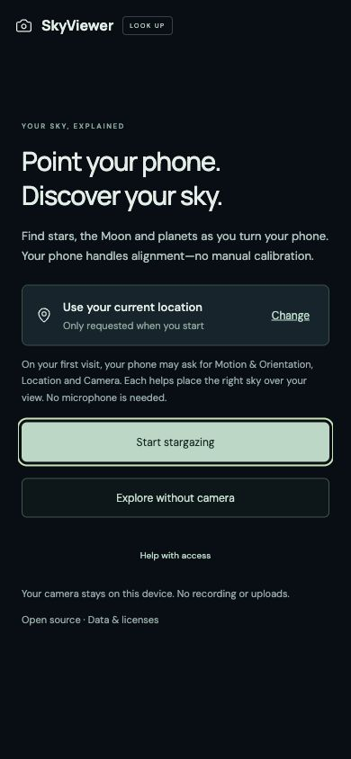
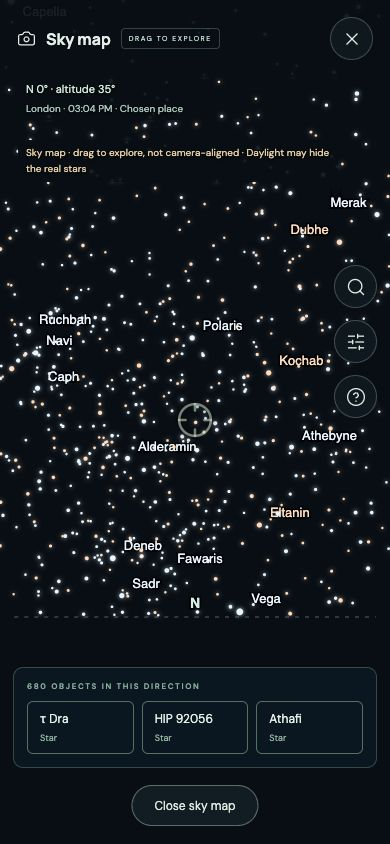
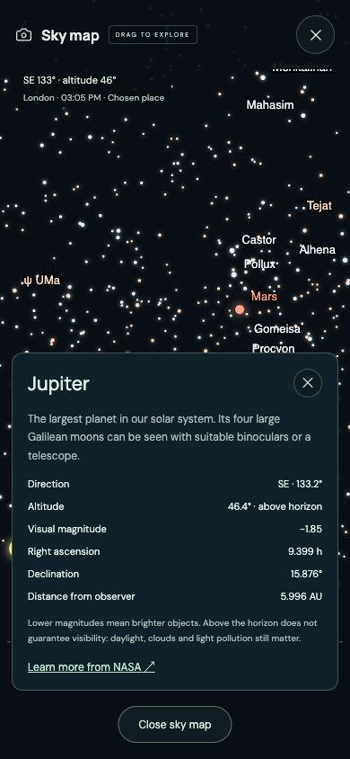
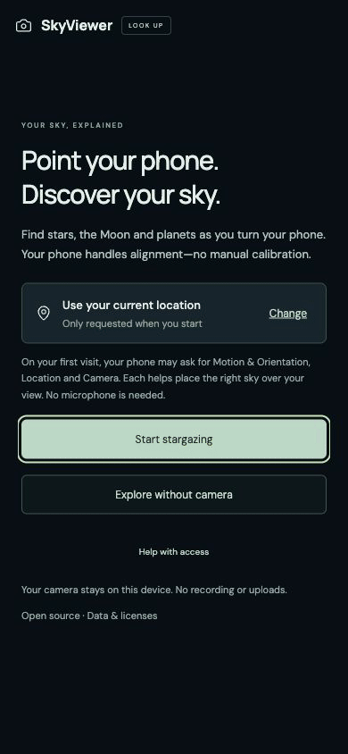

# SkyViewer Web

Point your phone at the sky to explore stars and planets through your camera.
Free and open source. No install or account.

**[Try SkyViewer →](https://sancerio.github.io/skyviewer-web/)**

## Is it for you?

- **Explore:** 5,044 catalog stars, the Sun, Moon and seven planets at the current time.
- **Find:** search for an object, follow guidance, and open its facts.
- **Point:** location and compass alignment are automatic on supported phones.
- **Browse without hardware:** choose a city and explore the sky map without camera or motion access.

AR needs a rear camera, motion sensors and HTTPS. Labels show calculated positions,
not image recognition or visibility forecasts. **Outdoor iPhone/Android alignment
accuracy is not yet verified.** No satellites, deep-sky images or telescope control.

## See it in use

| Start                                                                                                   | Explore without camera                                                                                         | Object details                                                                                                        |
| ------------------------------------------------------------------------------------------------------- | -------------------------------------------------------------------------------------------------------------- | --------------------------------------------------------------------------------------------------------------------- |
|  |  |  |

<details>
<summary>Watch the 22-second walkthrough</summary>



[Download the MP4](docs/media/setup-walkthrough.mp4) · [Location picker](docs/media/location.jpg)

</details>

Actual interface captures, paced for readability. Shows camera-free exploration,
not live AR or physical sensor accuracy. [Capture details](docs/media/README.md).

## Get started

1. Tap **Start stargazing** and allow motion, location and camera access when asked. Alternatively, choose a place with **Change**, then **Explore without camera**.
2. Point your phone at the sky—or drag the map. Search for a target and open **Information** for details.
3. Close the view to stop. Backgrounding or locking your phone also stops capture; tap **Resume stargazing** to continue.

Returning visitors see **Open camera**. iPhone Home Screen launches may still ask
for permissions again; iOS controls consent. Use **Help with access** for recovery.
[Permissions guide](docs/PERMISSIONS.md).

**Never aim binoculars or a telescope at the Sun using this app.**

## Privacy and saved places

No backend, analytics, microphone, recording or camera uploads. Calculations run
on your device. Display preferences are remembered; GPS coordinates are not saved
across launches unless you opt into **Sky display → Save observing place**.
A saved place is fixed, not live GPS: use **Use current location** after travelling,
or **Forget saved place** to remove it. Browser storage may be cleared or unavailable.
Hosting and OS location services have their own privacy policies.

## Run and verify

Use Node.js 22.12+ or 24 LTS:

```sh
npm ci
npm run dev
npm test
npm run build
```

Phone camera access needs HTTPS; plain HTTP on a LAN is not enough.
For Linux browser tests:

```sh
npx playwright install --with-deps chromium webkit
npm run test:e2e
```

Use a managed browser on macOS. Automated camera/sensor tests are synthetic;
[Camera AR](docs/CAMERA_AR.md) and [permissions](docs/PERMISSIONS.md) describe current
behavior and remaining physical-device checks. Older scope/verification docs are historical.

## Data and license

Built with React, TypeScript, Vite, Canvas 2D, Astronomy Engine and offline WMM2025.
[Contribute](CONTRIBUTING.md) · [Technical limits](docs/CAMERA_AR.md)

Code: [MIT](LICENSE). Catalog: BSD-3-Clause with [data credits](docs/DATA.md).
WMM2025 attribution: [Camera AR](docs/CAMERA_AR.md).
[Dependency and font notices](public/THIRD_PARTY_NOTICES.txt).
Independent of similarly named commercial apps.
